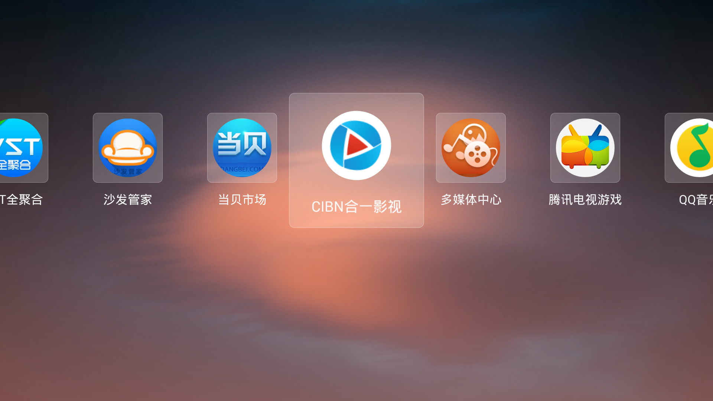
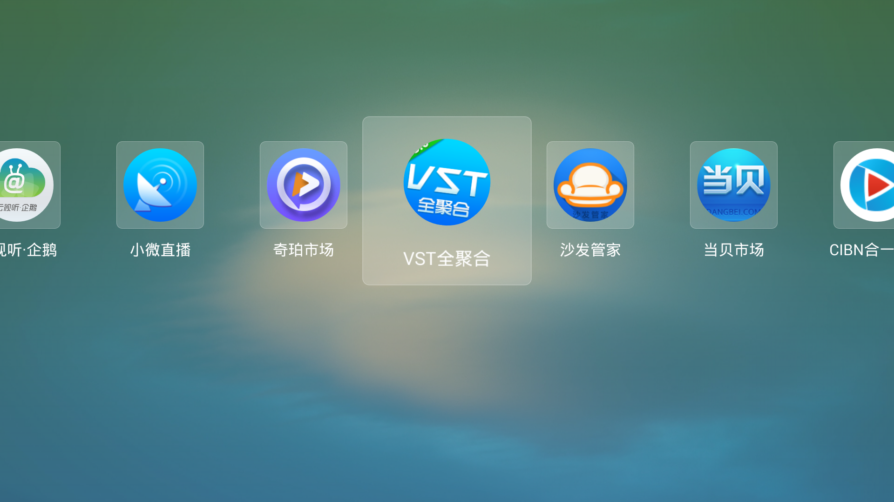
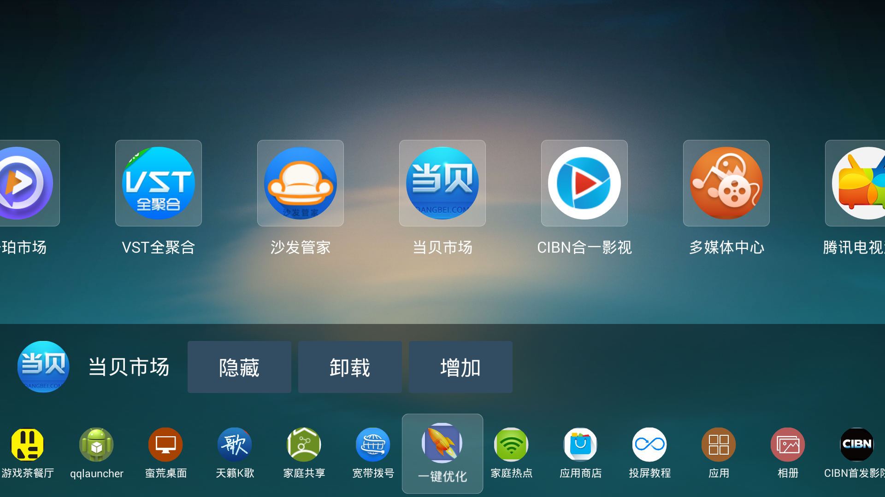

# 简单桌面

 

## [点击下载](https://fir.im/ht3l) 

随着智能电视的普及，各种TV版app的开发犹如雨后春笋纷纷问世，其中不乏桌面app。但是很多桌面app已经忘记了自己是桌面，添加各种各样的功能，恨不得打造一个全能的app，请问你这还是桌面吗？桌面最基本的功能就是通过桌面这个介质来找到并打开用户想要使用的app，融合了众多用户用不到的功能的桌面除了拖累系统没有实用价值。

 

**简单桌面**一款**免费**精简好用的Android TV桌面app，无任何附加功能，界面上只展示TV中安装的软件，**简单桌面**只做一件事情：找到你想打开的软件然后打开它。

 

当您通过摇控器操作**简单桌面**时，桌面会根据当前焦点图标自动计算与之匹配的背景色，是不是很酷！

 

系统预装的一些app，很多从来都不用，但又无法卸载掉，是不是很烦人？**简单桌面**增加的app隐藏功能可以让用户随时隐藏掉无需使用的app，当您需要时只需再次按下**菜单**键调出相应的app即可。

---

## 简单桌面还有更多人性化设计
* 小巧稳定高效，整个安装文件仅仅399KB
* 自动背景色
* app隐藏
* 根据用户使用频率自动排序
* 在线升级
* 焦点动画
* 应用卸载
* 更多新特性敬请期待

## 更多下载地址：

* [沙发管家](http://app.shafa.com/apk/manhuangzhuomian.html)
* [奇珀市场](http://down.7po.com/apps/8/manhuangzm.html)

## 作者：
* 微信号：**ayst_shen**
* E-Mail: **ayst.shen@foxmail.com**
